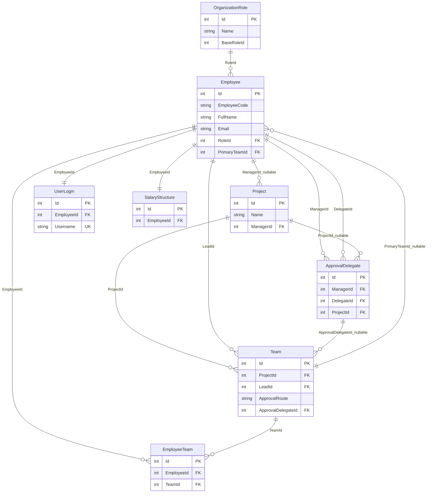
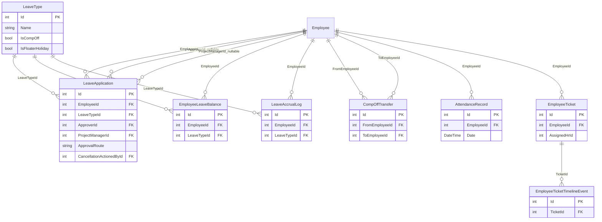
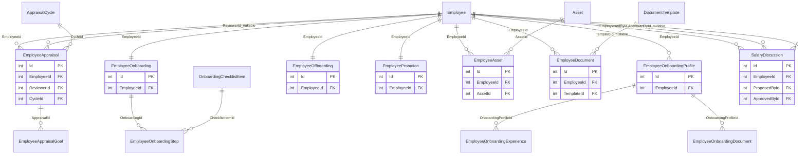

# ReliSoft HR Database ERD Review

Source of truth reviewed: `server/Migrations/AppDbContextModelSnapshot.cs` and `server/Data/AppDbContext.cs`.

The implemented backend is EF Core with SQL Server tables. `specs/database/schema.md` still describes a MongoDB/Mongoose schema, so that spec is currently stale compared with the code.

## Summary

- The main design center is `Employee`, with organization, leave, lifecycle, workplace, engagement, and operations modules around it.
- Business identifiers, one-per-owner records, and repeated membership/application records use unique indexes.
- Historical employee records use restrictive foreign keys, while selected user-facing records use standardized soft deletion.
- Shared mutable aggregates use SQL Server row-version concurrency tokens.
- Project ownership and team approval routing are explicit: project manager by default, with team-lead and validated-delegate alternatives.

## Relationship Review

### Residual considerations

- Workforce resilience tables are intentionally denormalized reporting data; their ID-like fields are not transactional foreign keys.
- Desk and room overlap prevention remains application-level because ordinary SQL check constraints cannot compare a row with other reservations.
- Employee writes enforce that `PrimaryTeamId` is included in `EmployeeTeam`, and team writes guarantee that the selected lead is a member.
- `specs/database/schema.md` describes a legacy MongoDB design and should not be treated as the implemented SQL Server schema.

## Core Organization

## Leave, Attendance, and Helpdesk

## HR Lifecycle, Documents, and Performance

## Engagement, Workplace, and Rewards

```mermaid
erDiagram
    Employee ||--o{ Announcement : CreatedById
    Employee ||--o{ KnowledgeBaseArticle : CreatedById
    Employee ||--o{ MoodEntry : EmployeeId
    Employee ||--o{ EmployeeSkill : EmployeeId
    EmployeeSkill ||--o{ SkillEndorsement : EmployeeSkillId
    Employee ||--o{ SkillEndorsement : EndorsedById
    Employee ||--o{ BragPost : EmployeeId
    BragPost ||--o{ BragLike : BragPostId
    Employee ||--o{ BragLike : EmployeeId
    Employee ||--o{ CommuteRoute : EmployeeId
    CarpoolGroup ||--o{ CarpoolMember : GroupId
    Employee ||--o{ CarpoolMember : EmployeeId
    Desk ||--o{ DeskBooking : DeskId
    Employee ||--o{ DeskBooking : EmployeeId
    MeetingRoom ||--o{ RoomBooking : RoomId
    Employee ||--o{ RoomBooking : EmployeeId
    Employee ||--o{ MentorshipProfile : EmployeeId
    Employee ||--o{ MentorshipMatch : MentorId
    Employee ||--o{ MentorshipMatch : MenteeId
    MentorshipMatch ||--o{ MentorshipSession : MatchId
    Employee ||--|| RewardPointsAccount : EmployeeId
    Employee ||--o{ RewardTransaction : EmployeeId
    Employee ||--o{ RewardRedemption : EmployeeId
    RewardCatalogItem ||--o{ RewardRedemption : ItemId
    Employee ||--o{ Survey : CreatedById
    Survey ||--o{ SurveyQuestion : SurveyId
    Survey ||--o{ SurveyResponse : SurveyId
    SurveyQuestion ||--o{ SurveyResponse : QuestionId
    Employee ||--o{ SurveyResponse : EmployeeId
    Employee ||--o{ Notification : EmployeeId

    MoodEntry {
        int Id PK
        int EmployeeId FK
        DateTime Date UK
    }
    EmployeeSkill {
        int Id PK
        int EmployeeId FK
        string SkillName UK
    }
    BragPost {
        int Id PK
        int EmployeeId FK
    }
    CarpoolMember {
        int Id PK
        int GroupId FK
        int EmployeeId FK
    }
    DeskBooking {
        int Id PK
        int DeskId FK
        int EmployeeId FK
    }
    RoomBooking {
        int Id PK
        int RoomId FK
        int EmployeeId FK
    }
    SurveyResponse {
        int Id PK
        int SurveyId FK
        int QuestionId FK
        int EmployeeId FK
    }
```

## Operations and Administration

```mermaid
erDiagram
    Employee ||--o{ BenefitEnrollment : EmployeeId
    BenefitPlan ||--o{ BenefitEnrollment : BenefitPlanId
    Employee ||--o{ ExpenseClaim : EmployeeId
    Employee ||--o{ ExpenseClaim : ApprovedById_nullable
    ExpenseCategory ||--o{ ExpenseClaim : CategoryId
    Employee ||--o{ TimesheetEntry : EmployeeId
    Employee ||--o{ TimesheetEntry : ApprovedById_nullable
    Project ||--o{ TimesheetEntry : ProjectId_nullable
    Employee ||--o{ TimesheetPeriod : EmployeeId
    Employee ||--o{ TimesheetPeriod : ApprovedById_nullable
    TrainingCourse ||--o{ TrainingRegistration : CourseId
    Employee ||--o{ TrainingRegistration : EmployeeId
    Employee ||--o{ EmployeeLoan : EmployeeId
    Employee ||--o{ EmployeeLoan : ApprovedById_nullable
    LoanType ||--o{ EmployeeLoan : LoanTypeId
    EmployeeLoan ||--o{ LoanRepayment : LoanId
    Employee ||--o{ ShiftAssignment : EmployeeId
    ShiftTemplate ||--o{ ShiftAssignment : ShiftTemplateId
    Employee ||--o{ ShiftSwap : RequestedById
    Employee ||--o{ ShiftSwap : TargetEmployeeId
    Employee ||--o{ Visitor : HostEmployeeId_nullable
    ComplianceRequirement ||--o{ ComplianceRecord : RequirementId
    Employee ||--o{ ComplianceRecord : EmployeeId_nullable
    Contractor ||--o{ ContractorEmployee : ContractorId
    Employee ||--o{ InternalJobPosting : CreatedById
    InternalJobPosting ||--o{ InternalJobApplication : JobPostingId
    Employee ||--o{ InternalJobApplication : EmployeeId

    BenefitEnrollment {
        int Id PK
        int EmployeeId FK
        int BenefitPlanId FK
    }
    ExpenseClaim {
        int Id PK
        int EmployeeId FK
        int CategoryId FK
        int ApprovedById FK
    }
    TimesheetEntry {
        int Id PK
        int EmployeeId FK
        int ProjectId FK
        int ApprovedById FK
    }
    TrainingRegistration {
        int Id PK
        int CourseId FK
        int EmployeeId FK
    }
    EmployeeLoan {
        int Id PK
        int EmployeeId FK
        int LoanTypeId FK
        int ApprovedById FK
    }
    ShiftAssignment {
        int Id PK
        int EmployeeId FK
        int ShiftTemplateId FK
    }
    InternalJobApplication {
        int Id PK
        int JobPostingId FK
        int EmployeeId FK
    }
```

## Workforce Resilience Tables

These are implemented as standalone tables. They contain duplicated names and ID-like columns, but EF does not define relationships to `Employees`, `Projects`, or users.

```mermaid
erDiagram
    WorkforceEmployee {
        int Id PK
        string EmployeeCode
        string FullName
        string Team
        string Role
    }
    WorkforceProject {
        int Id PK
        string ProjectCode
        string ProjectName
        string Team
        string Client
    }
    WorkforceDependency {
        int Id PK
        int OwnerId
        int DependentId
        string DependencyType
    }
    WorkforceKnowledge {
        int Id PK
        int EmployeeId
        string EmployeeName
        string KnowledgeArea
    }
    WorkforcePerformance {
        int Id PK
        int EmployeeId
        string EmployeeName
        string Team
    }
    WorkforceWorkload {
        int Id PK
        int EmployeeId
        string EmployeeName
        string Team
    }
    WorkforceScenario {
        int Id PK
        int CreatedById
        string Name
        string Status
    }
    WorkforceFeedback {
        int Id PK
        int EmployeeId
        string EmployeeName
        string ActionTitle
    }
```

## Table Coverage

### Core

`Employees`, `UserLogins`, `OrganizationRoles`, `Projects`, `Teams`, `EmployeeTeams`, `ApprovalDelegates`, `SalaryStructures`

### Leave, Attendance, and Tickets

`LeaveTypes`, `LeaveApplications`, `EmployeeLeaveBalances`, `LeaveAccrualLogs`, `CompOffTransfers`, `AttendanceRecords`, `EmployeeTickets`, `EmployeeTicketTimelineEvents`, `HrPolicies`

### Lifecycle, Documents, Assets, Performance

`EmployeeOnboardingProfiles`, `EmployeeOnboardingExperiences`, `EmployeeOnboardingDocuments`, `EmployeeOnboardings`, `EmployeeOnboardingSteps`, `OnboardingChecklistItems`, `EmployeeOffboardings`, `EmployeeProbations`, `Assets`, `EmployeeAssets`, `DocumentTemplates`, `EmployeeDocuments`, `AppraisalCycles`, `EmployeeAppraisals`, `EmployeeAppraisalGoals`, `SalaryDiscussions`

### Engagement and Workplace

`Announcements`, `KnowledgeBaseArticles`, `MoodEntries`, `EmployeeSkills`, `SkillEndorsements`, `BragPosts`, `BragLikes`, `CommuteRoutes`, `CarpoolGroups`, `CarpoolMembers`, `Desks`, `MeetingRooms`, `DeskBookings`, `RoomBookings`, `MentorshipProfiles`, `MentorshipMatches`, `MentorshipSessions`, `Surveys`, `SurveyQuestions`, `SurveyResponses`, `Notifications`, `NotificationTemplates`

### Operations

`BenefitPlans`, `BenefitEnrollments`, `ExpenseCategories`, `ExpenseClaims`, `TimesheetEntries`, `TimesheetPeriods`, `TrainingCourses`, `TrainingRegistrations`, `LoanTypes`, `EmployeeLoans`, `LoanRepayments`, `ShiftTemplates`, `ShiftAssignments`, `ShiftSwaps`, `Visitors`, `ComplianceRequirements`, `ComplianceRecords`, `Contractors`, `ContractorEmployees`, `InternalJobPostings`, `InternalJobApplications`, `RewardPointsAccounts`, `RewardTransactions`, `RewardCatalogItems`, `RewardRedemptions`

### Workforce Resilience

`WorkforceEmployees`, `WorkforceProjects`, `WorkforceDependencies`, `WorkforceKnowledges`, `WorkforcePerformances`, `WorkforceWorkloads`, `WorkforceScenarios`, `WorkforceFeedbacks`

## Indexes Worth Keeping

- `EmployeeTeams`: unique `(EmployeeId, TeamId)`
- `EmployeeLeaveBalances`: unique `(EmployeeId, LeaveTypeId)`
- `UserLogins`: unique `EmployeeId`, unique `Username`
- `SalaryStructures`: unique `EmployeeId`
- `EmployeeOnboardings`, `EmployeeOffboardings`, `EmployeeProbations`: unique `EmployeeId`
- `MoodEntries`: unique `(EmployeeId, Date)`
- `EmployeeSkills`: unique `(EmployeeId, SkillName)`
- `SkillEndorsements`: unique `(EmployeeSkillId, EndorsedById)`
- `BragLikes`: unique `(BragPostId, EmployeeId)`
- `CarpoolMembers`: unique `(GroupId, EmployeeId)`
- `DeskBookings`: unique `(DeskId, Date, StartTime)`
- `RoomBookings`: unique `(RoomId, Date, StartTime)`
- `MentorshipProfiles`: unique `EmployeeId`
- `RewardPointsAccounts`: unique `EmployeeId`
