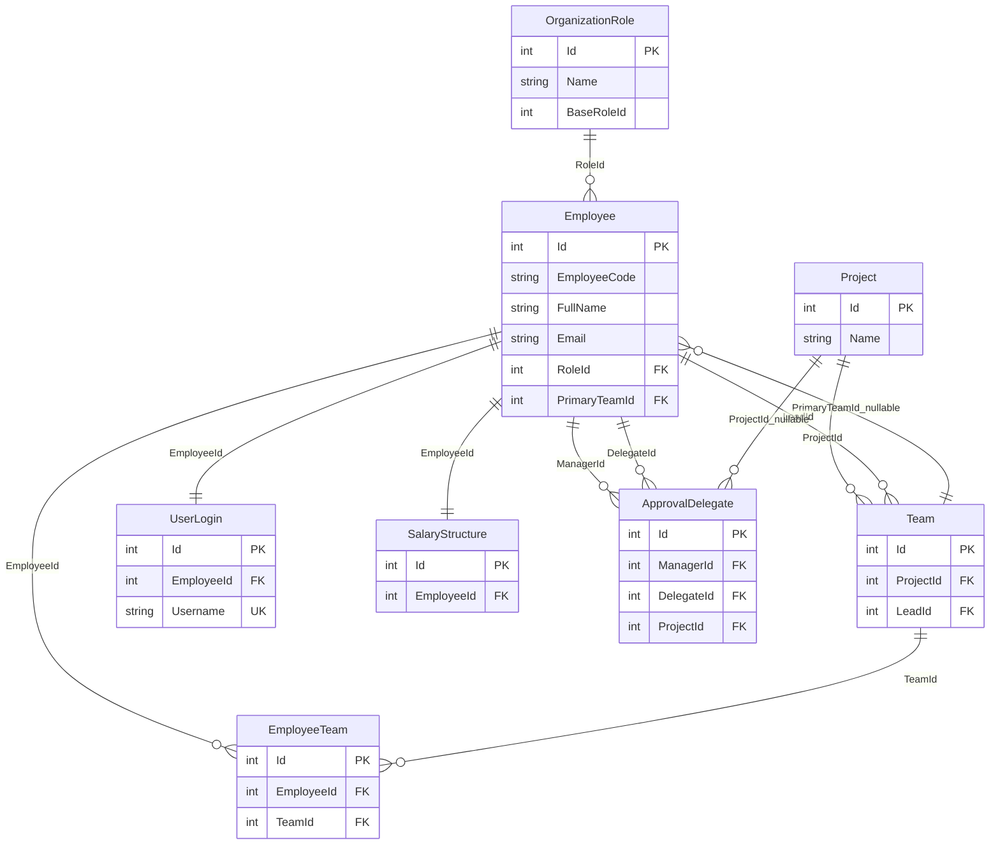
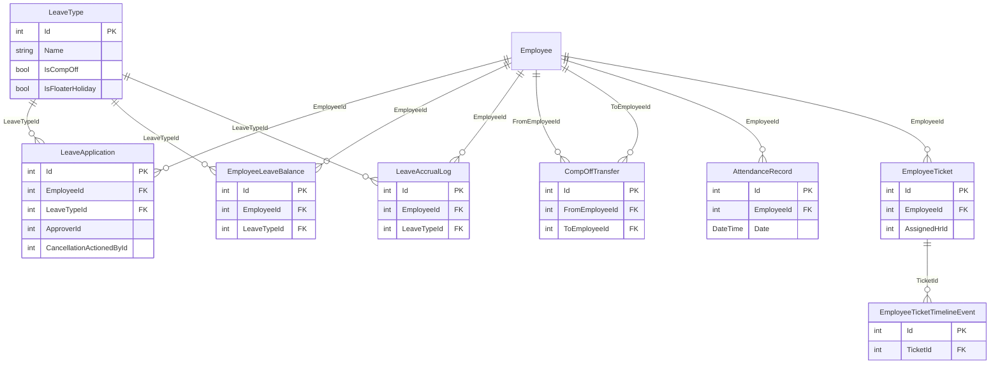

# ReliSoft HR Database ERD Review

Source of truth reviewed: `server/Migrations/AppDbContextModelSnapshot.cs` and `server/Data/AppDbContext.cs`.

The implemented backend is EF Core with SQL Server tables. `specs/database/schema.md` still describes a MongoDB/Mongoose schema, so that spec is currently stale compared with the code.

## Summary

- Tables in implemented EF model: 88
- Relationships in implemented EF model: 98
- Main design center: `Employee`, with organization, leave, lifecycle, workplace, engagement, and operations modules around it.
- Overall EF relationship wiring is mostly coherent, but there are several missing uniqueness and referential constraints that can allow duplicate or orphaned business data.

## Relationship Review

### High priority

- `Employee.EmployeeCode` and `Employee.Email` are required but not unique in the EF model. HR systems normally require both to be unique. Add unique indexes for `EmployeeCode` and, if business rules require it, `Email`.
- `LeaveApplication.ApproverId`, `LeaveApplication.CancellationActionedById`, and `EmployeeTicket.AssignedHrId` are stored as IDs but are not foreign keys. If these should point to employees or users, add navigation properties and FK configuration.
- Workforce resilience tables contain ID-looking fields (`EmployeeId`, `OwnerId`, `DependentId`, `CreatedById`) but have no real FKs. That makes the workforce module a denormalized reporting area rather than a relational module.
- `ApprovalDelegate` has a unique index on `(ManagerId, ProjectId, DelegateId)`, but SQL Server filters nullable unique indexes to rows where `ProjectId IS NOT NULL`. This means duplicate global delegates with `ProjectId = null` are still possible.
- The implemented schema and documented schema are for different databases: SQL Server/EF Core in code versus MongoDB/Mongoose in `specs/database/schema.md`.

### Medium priority

- `AttendanceRecord` only has an index on `EmployeeId`; it does not enforce one record per employee per date. Consider a unique `(EmployeeId, Date)` index.
- `SurveyResponse` stores both `SurveyId` and `QuestionId`, but there is no database constraint that the question belongs to the same survey as the response. A wrong pair can be inserted unless guarded in application logic.
- `InternalJobApplication` and `TrainingRegistration` do not prevent duplicate applications/registrations for the same employee and posting/course. Consider unique indexes on `(JobPostingId, EmployeeId)` and `(CourseId, EmployeeId)`.
- `DeskBooking` and `RoomBooking` prevent duplicate bookings with the same start time, but not overlapping time ranges. This needs application validation or stronger persisted constraints.
- `Employee.PrimaryTeamId` and `EmployeeTeam` can disagree. If primary team must be one of the employee's memberships, enforce that in service logic or with a stricter model.
- Several employee-owned records cascade on employee delete. That may be fine for hard-delete cleanup, but HR systems often prefer soft delete or `NoAction` for audit history.

## Core Organization

## Leave, Attendance, and Helpdesk

## HR Lifecycle, Documents, and Performance

## Engagement, Workplace, and Rewards

## Operations and Administration

## Workforce Resilience Tables

These are implemented as standalone tables. They contain duplicated names and ID-like columns, but EF does not define relationships to `Employees`, `Projects`, or users.

```mermaid
erDiagram
    WorkforceEmployee {
        int Id PK
        string EmployeeCode
        string FullName
        string Team
        string Role
    }
    WorkforceProject {
        int Id PK
        string ProjectCode
        string ProjectName
        string Team
        string Client
    }
    WorkforceDependency {
        int Id PK
        int OwnerId
        int DependentId
        string DependencyType
    }
    WorkforceKnowledge {
        int Id PK
        int EmployeeId
        string EmployeeName
        string KnowledgeArea
    }
    WorkforcePerformance {
        int Id PK
        int EmployeeId
        string EmployeeName
        string Team
    }
    WorkforceWorkload {
        int Id PK
        int EmployeeId
        string EmployeeName
        string Team
    }
    WorkforceScenario {
        int Id PK
        int CreatedById
        string Name
        string Status
    }
    WorkforceFeedback {
        int Id PK
        int EmployeeId
        string EmployeeName
        string ActionTitle
    }
```

## Table Coverage

### Core

`Employees`, `UserLogins`, `OrganizationRoles`, `Projects`, `Teams`, `EmployeeTeams`, `ApprovalDelegates`, `SalaryStructures`

### Leave, Attendance, and Tickets

`LeaveTypes`, `LeaveApplications`, `EmployeeLeaveBalances`, `LeaveAccrualLogs`, `CompOffTransfers`, `AttendanceRecords`, `EmployeeTickets`, `EmployeeTicketTimelineEvents`, `HrPolicies`

### Lifecycle, Documents, Assets, Performance

`EmployeeOnboardingProfiles`, `EmployeeOnboardingExperiences`, `EmployeeOnboardingDocuments`, `EmployeeOnboardings`, `EmployeeOnboardingSteps`, `OnboardingChecklistItems`, `EmployeeOffboardings`, `EmployeeProbations`, `Assets`, `EmployeeAssets`, `DocumentTemplates`, `EmployeeDocuments`, `AppraisalCycles`, `EmployeeAppraisals`, `EmployeeAppraisalGoals`, `SalaryDiscussions`

### Engagement and Workplace

`Announcements`, `KnowledgeBaseArticles`, `MoodEntries`, `EmployeeSkills`, `SkillEndorsements`, `BragPosts`, `BragLikes`, `CommuteRoutes`, `CarpoolGroups`, `CarpoolMembers`, `Desks`, `MeetingRooms`, `DeskBookings`, `RoomBookings`, `MentorshipProfiles`, `MentorshipMatches`, `MentorshipSessions`, `Surveys`, `SurveyQuestions`, `SurveyResponses`, `Notifications`, `NotificationTemplates`

### Operations

`BenefitPlans`, `BenefitEnrollments`, `ExpenseCategories`, `ExpenseClaims`, `TimesheetEntries`, `TimesheetPeriods`, `TrainingCourses`, `TrainingRegistrations`, `LoanTypes`, `EmployeeLoans`, `LoanRepayments`, `ShiftTemplates`, `ShiftAssignments`, `ShiftSwaps`, `Visitors`, `ComplianceRequirements`, `ComplianceRecords`, `Contractors`, `ContractorEmployees`, `InternalJobPostings`, `InternalJobApplications`, `RewardPointsAccounts`, `RewardTransactions`, `RewardCatalogItems`, `RewardRedemptions`

### Workforce Resilience

`WorkforceEmployees`, `WorkforceProjects`, `WorkforceDependencies`, `WorkforceKnowledges`, `WorkforcePerformances`, `WorkforceWorkloads`, `WorkforceScenarios`, `WorkforceFeedbacks`

## Indexes Worth Keeping

- `EmployeeTeams`: unique `(EmployeeId, TeamId)`
- `EmployeeLeaveBalances`: unique `(EmployeeId, LeaveTypeId)`
- `UserLogins`: unique `EmployeeId`, unique `Username`
- `SalaryStructures`: unique `EmployeeId`
- `EmployeeOnboardings`, `EmployeeOffboardings`, `EmployeeProbations`: unique `EmployeeId`
- `MoodEntries`: unique `(EmployeeId, Date)`
- `EmployeeSkills`: unique `(EmployeeId, SkillName)`
- `SkillEndorsements`: unique `(EmployeeSkillId, EndorsedById)`
- `BragLikes`: unique `(BragPostId, EmployeeId)`
- `CarpoolMembers`: unique `(GroupId, EmployeeId)`
- `DeskBookings`: unique `(DeskId, Date, StartTime)`
- `RoomBookings`: unique `(RoomId, Date, StartTime)`
- `MentorshipProfiles`: unique `EmployeeId`
- `RewardPointsAccounts`: unique `EmployeeId`
